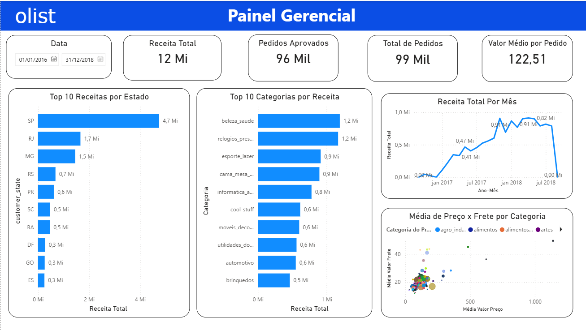

# Olist - Medallion Architecture no Microsoft Fabric

Repositório oficial do projeto de **Data Lakehouse** implementando a **Medallion Architecture** (Bronze → Silver → Gold) utilizando **Delta Lake** no Microsoft Fabric.

---

##  Objetivo do Projeto

Desenvolver um pipeline end-to-end de dados da **Olist** (maior marketplace da América Latina) seguindo as melhores práticas de engenharia de dados moderna, com governança, rastreabilidade, idempotência e performance.

O projeto demonstra a construção completa de um **Lakehouse** corporativo, desde a ingestão de dados brutos até a camada analítica otimizada para consumo em Power BI e futuros modelos de Machine Learning.

---

##  Arquitetura Medallion

O projeto segue rigorosamente o padrão **Medallion Architecture**, com **bancos/schema separados por camada**:

| Camada   | Banco/Schema          | Propósito                                      | Formato     | Qualidade dos Dados |
|----------|-----------------------|------------------------------------------------|-------------|---------------------|
| **Bronze**   | `olist`              | Landing Zone - Dados brutos                    | Delta Lake  | Raw (como fonte)    |
| **Silver**   | `silver_olist`       | Staging Zone - Dados limpos e enriquecidos     | Delta Lake  | Cleansed + Validated|
| **Gold**     | `gold_olist`         | Consumption Zone - Modelo Dimensional          | Delta Lake  | Business Ready      |

---

## Detalhes de Implementação por Camada

### 1. Camada Bronze (Raw / Landing)

**Responsabilidades:**
- Ingestão dos arquivos CSV originais da Olist via `requests`
- Criação do banco `olist`
- Armazenamento fiel dos dados fonte (sem qualquer transformação)
- Tabelas prefixadas com `lnd_bronze_*`

**Tabelas principais:**
- `lnd_bronze_customers`, `lnd_bronze_orders`, `lnd_bronze_order_items`, `lnd_bronze_products`, `lnd_bronze_sellers`, `lnd_bronze_geolocation`, `lnd_bronze_order_payments`, `lnd_bronze_order_reviews`, `lnd_bronze_product_category_name_translation`

**Notebook:** [`Camada_Bronze.ipynb`](Camada_Bronze.ipynb)

---

### 2. Camada Silver (Staging / Cleansed)

**Principais Processos:**

- **Criação do banco** `silver_olist`
- **Padronização** de nomes de colunas e tipos de dados
- **Deduplicação** baseada em chave primária (ex: `customer_id`, `order_id`, `review_id`, etc.)
- **Limpeza de dados** (tratamento de nulos, strings, unicodedata quando necessário)
- **CDC (Change Data Capture)** via **MERGE Delta** para cargas incrementais/idempotentes
- Criação de tabelas `stg_*`

**Destaques técnicos:**
- Uso de `DeltaTable` para operações de `MERGE`
- Deduplicação explícita antes do merge
- Manutenção de histórico completo dos dados limpos

**Notebook:** [`Camada_Prata.ipynb`](Camada_Prata.ipynb)

---

### 3. Camada Gold (Business / Dimensional Model)

**Modelo Dimensional (Star Schema)**

#### Dimensões

- **`dim_customers`** → **SCD Tipo 2** completo
  - Surrogate Key (`sk_customer`) gerada com `hash(concat_ws("||", customer_id, city, state))`
  - Natural Key (`nk_customer`)
  - Colunas de controle: `dt_inicio`, `dt_fim`, `fl_atual`
  - Lógica de expiração e inserção de novas versões quando há mudança de endereço

- **`dim_sellers`** → SCD Tipo 1 (overwrite)
- **`dim_products`** → SCD Tipo 1 + join com tradução de categoria
- **`dim_calendar`** → Gerada dinamicamente a partir do intervalo mínimo/máximo de `order_purchase_timestamp`

#### Tabela Fato

- **`ft_orders`**
  - Granularidade: `order_item`
  - SKs para todas as dimensões (incluindo `sk_customer` apontando para versão correta do SCD2 no momento da compra)
  - Métricas: `vlr_price`, `vlr_freight`
  - Atributos descritivos e timestamps originais

**Notebook:** [`Camada_Gold.ipynb`](Camada_Gold.ipynb)

---

##  Estratégias de Qualidade de Dados

- **Deduplicação** robusta por chave de negócio
- **Padronização** consistente (lowercase, remoção de acentos quando aplicável)
- **Validação de integridade** via joins na camada Gold
- **Idempotência** total dos pipelines (pode ser executado múltiplas vezes sem duplicação)
- **Rastreabilidade** via Surrogate Keys e Natural Keys
- **Histórico completo** de mudanças (SCD2)

---

##  Dashboard Power BI

Conectado diretamente no **SQL Endpoint** do Lakehouse (camada Gold).

### KPIs do Painel
- **Receita Total**: R$ 12 Milhões
- **Pedidos Aprovados**: 96 Mil
- **Total de Pedidos**: 99 Mil
- **Valor Médio por Pedido**: R$ 122,51

**Visualizações principais:**
- Top 10 Estados por Receita
- Top 10 Categorias por Receita
- Série temporal de Receita Mensal
- Scatter Plot: Preço Médio × Frete por Categoria

---

##  Stack Tecnológica

- **Orquestração & Processamento**: PySpark + Microsoft Fabric Notebooks
- **Storage**: Delta Lake (ACID, Time Travel, Z-Ordering implícito)
- **Catalog**: Unity Catalog (Microsoft Fabric)
- **Modelagem**: Star Schema + Slowly Changing Dimension Type 2
- **BI Tool**: Power BI
- **Versionamento**: Git + GitHub

---

##  Como Executar o Projeto

1. Clone o repositório
2. No Microsoft Fabric:
   - Crie um **Lakehouse**
   - Execute os notebooks **na seguinte ordem**:
     1. `Camada_Bronze.ipynb`
     2. `Camada_Prata.ipynb`
     3. `Camada_Gold.ipynb`
3. Conecte o Power BI no SQL Endpoint do Lakehouse

---

##  Principais Boas Práticas Aplicadas

- Separação clara de responsabilidades por camada
- Uso correto de **SCD2** para atributos mutáveis (endereço do cliente)
- **Hash-based Surrogate Keys** para performance e anonimização
- Geração dinâmica da dimensão de calendário
- Pipelines idempotentes e reexecutáveis
- Modelo otimizado para consumo analítico (DAX)

---

## Roadmap Futuro

- [ ] Orquestração com **Data Factory** ou **Fabric Pipelines**
- [ ] Data Quality Framework (Great Expectations / Deequ)
- [ ] dbt Fabric para transformação declarativa
- [ ] Semantic Model + Security (RLS)
- [ ] Monitoramento e Alertas
- [ ] CI/CD completo

---

